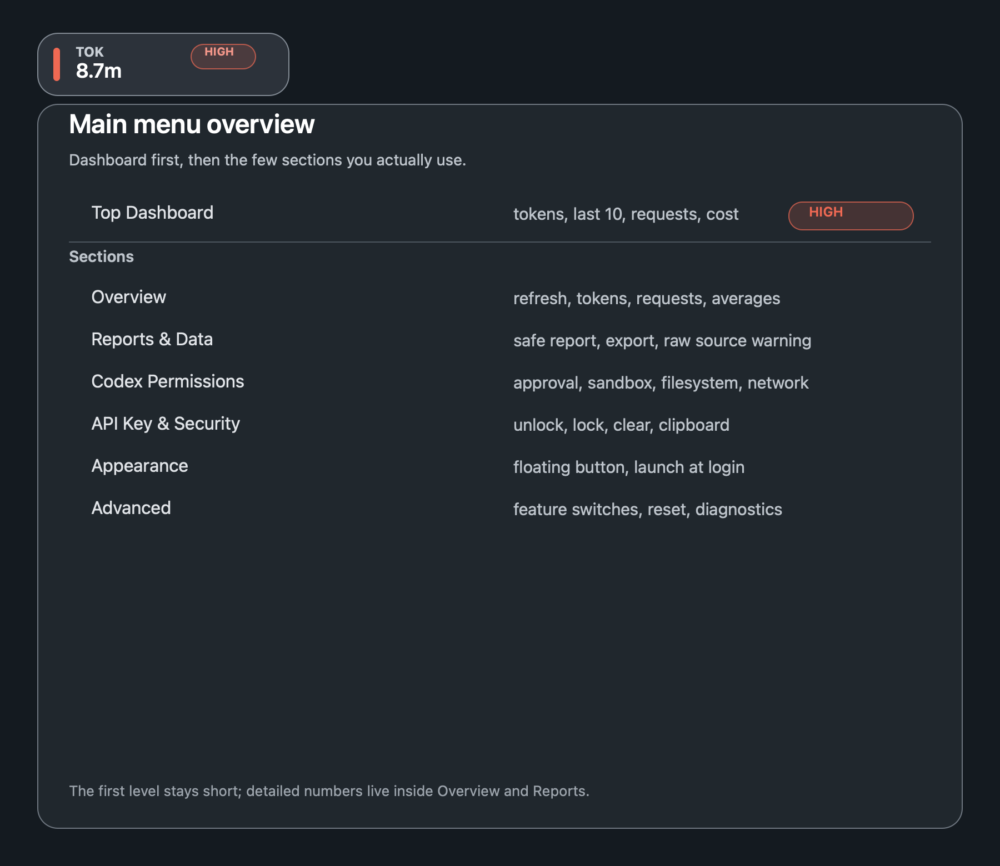
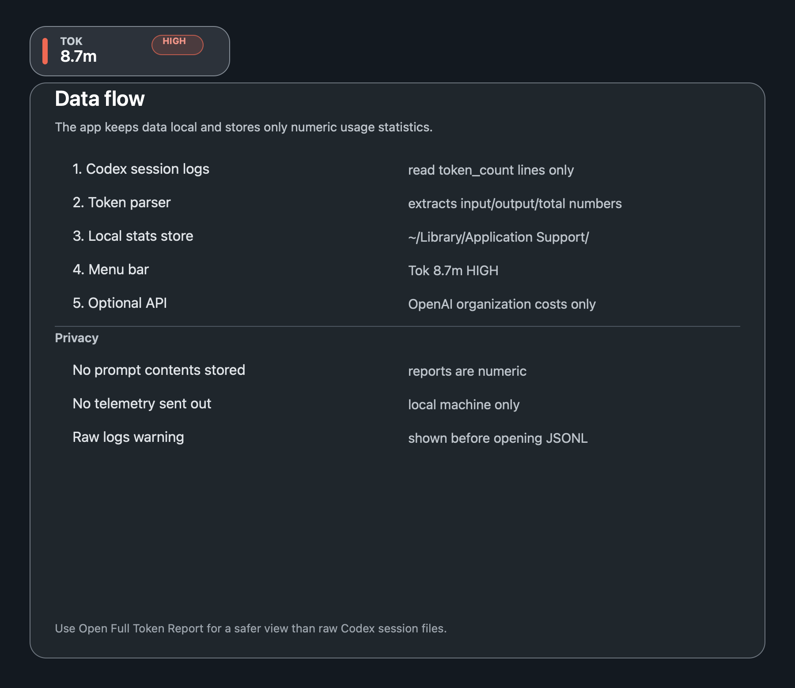
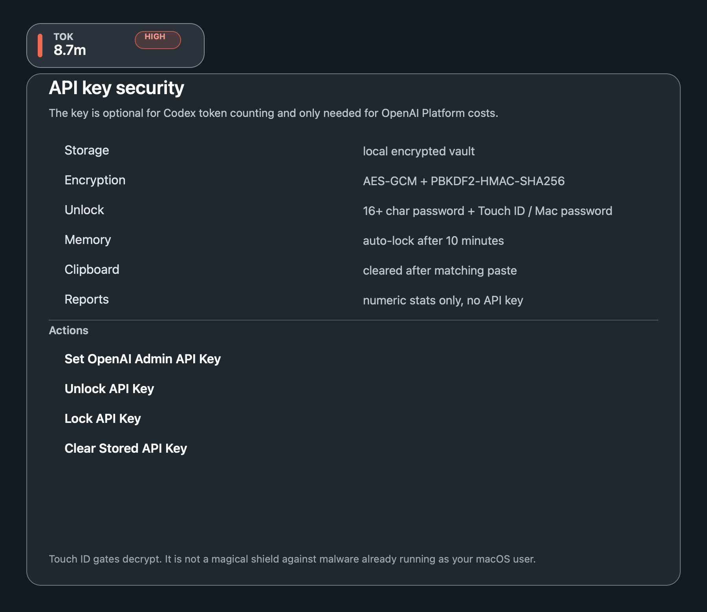
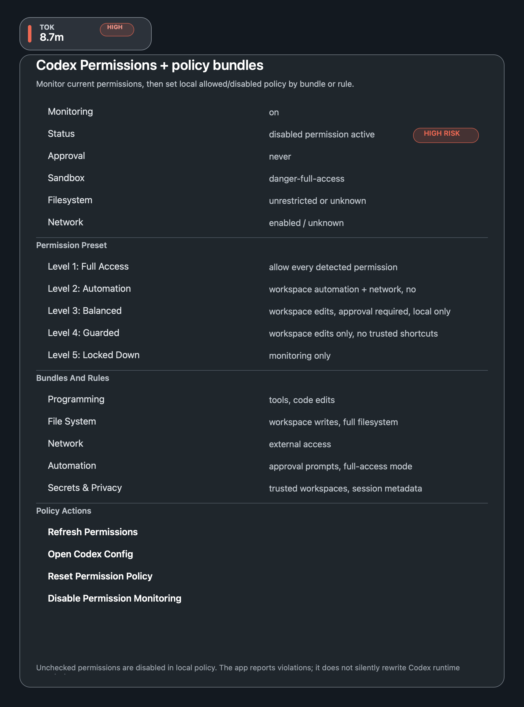

# Codex Token Monitor Help

This help is local. It is bundled with the app and does not load remote content.

## What This App Does

Codex Token Monitor is a lightweight macOS menu bar app.

- It shows Codex token usage in the menu bar.
- It reads local Codex `token_count` events.
- It can optionally use the OpenAI Admin Usage API for organization API costs.
- It monitors local Codex permission metadata.
- It stores numeric statistics only.
- It does not store prompt contents.
- It does not send local Codex token data outside this Mac.



## Menu Bar Indicator

The menu bar indicator is compact:

```text
Tok 124k
Tok 124k WARN
Tok 1.6m HIGH
```

The dropdown is organized around the common workflow:

- **Overview**: refresh, tokens, requests, costs, averages.
- **Reports & Data**: full report, raw source, export, breakdowns.
- **Codex Permissions**: current permission state and local policy toggles.
- **API Key & Security**: unlock, lock, set, clear, clipboard key.
- **Appearance**: floating button and launch at login.
- **Advanced**: feature switches, reset, diagnostics.

If the macOS menu bar is crowded and hides the item, the app also shows a small floating `Tok...` button near the top-right of the screen. Click it to open the same dropdown menu.

The floating button is draggable. Move it anywhere on screen; the app saves its position. Use **Appearance -> Reset Floating Button Position** if you want to return it to the default top-right location.

## Floating Button

The app can show a small floating `Tok` button when the macOS menu bar is crowded. It opens the same dropdown menu as the menu bar item.

Controls:

- **Appearance -> Show Floating Button**
- **Appearance -> Hide Floating Button**
- **Appearance -> Reset Floating Button Position**

## Token Data Sources

For Codex desktop/session usage, the app reads:

```text
~/.codex/sessions/**/*.jsonl
```

It stream-reads session files and imports only `token_count` events. For Codex session logs, it ignores non-token-count lines so prompt/message content is not parsed for normal token monitoring.

The app uses `last_token_usage` as the per-request sample. It deliberately ignores cumulative `total_token_usage` for counting, because summing cumulative totals would double count.



## OpenAI API Usage

The OpenAI Admin API key is optional.

Use it only if you want OpenAI Platform organization usage and cost data:

```text
GET /v1/organization/usage/completions
GET /v1/organization/costs
```

Important: these endpoints count API Platform organization usage. They do not count Codex desktop chat tokens. Codex token counting comes from local Codex session logs.

## API Key Security

The API key is saved in a local encrypted vault:

```text
~/Library/Application Support/CodexTokenMenuBar/api-key.vault.json
```

Security behavior:

- AES-GCM encryption.
- PBKDF2-HMAC-SHA256 key derivation.
- New vaults use 600,000 PBKDF2 iterations.
- New vaults authenticate vault metadata.
- New local encryption passwords must be at least 16 characters and use mixed character types.
- The vault file is checked for private ownership, mode, and symlink safety before decrypting.
- Unlock requires the local encryption password plus Touch ID or macOS password.
- The unlocked key auto-locks after 10 minutes.
- Clipboard is cleared after the app pastes a matching API key.
- Reports, settings, stats, and logs do not contain the plaintext API key.



Touch ID gates decrypt. It does not make the process impossible to inspect if malware is already running as your macOS user. Use a strong local encryption password and keep the app bundle trusted.

## Codex Permission Monitoring

The **Codex Permissions** menu monitors local Codex permission metadata:

- approval policy;
- sandbox policy;
- permission profile;
- filesystem policy;
- network access;
- trusted workspace count;
- source config/session paths.
- local permission policy bundles and per-permission toggles.

It reads:

```text
~/.codex/config.toml
~/.codex/sessions/**/*.jsonl
```

For session files, it reads only `turn_context` metadata lines. It does not read `.codex-global-state.json`, because that file can contain prompt history.



Risk labels:

- `HIGH RISK`: broad filesystem access, disabled permission profile, unrestricted filesystem, or danger-full-access sandbox.
- `WARNING`: network enabled, approval prompts disabled, or permission metadata unavailable.
- `OK`: constrained sandbox/filesystem metadata was found.

The app monitors permissions. It does not silently change Codex permissions. You can turn monitoring on/off from **Codex Permissions** or **Advanced**.

### Permission Bundles

Use **Codex Permissions -> Permission Preset** for a fast policy baseline:

- **Level 1: Full Access** allows every detected Codex permission. Use only for fully trusted local work.
- **Level 2: Automation** allows unattended workspace automation and network, but blocks full filesystem/full-access mode.
- **Level 3: Balanced** allows normal workspace edits, requires approval prompts, and blocks network/full access.
- **Level 4: Guarded** allows workspace edits only, and blocks trusted workspace shortcuts, network, no-approval mode, and full access.
- **Level 5: Locked Down** allows this app to monitor local permission metadata only. Any write, network, trusted workspace, or no-approval mode becomes a policy violation.

If you manually change a bundle or individual permission after choosing a preset, the preset label becomes **Custom**.

The app also has a local policy layer. A checked permission means **allowed by your local policy**. An unchecked permission means **disabled by your local policy**. If Codex is currently running with a disabled permission, the app shows a violation.

Bundles:

- **Programming**: running tools without approval, workspace code edits.
- **File System**: workspace file writes, full filesystem access.
- **Network**: network access.
- **Automation**: unattended automation, full-access mode.
- **Secrets & Privacy**: trusted workspaces, local session metadata monitoring.

Turning a bundle off disables all permissions inside it. You can then re-enable individual permissions inside that bundle.

This policy layer is intentionally local to the menu bar app. It does not silently rewrite Codex runtime permissions. Use Codex settings/config to change actual Codex execution permissions.

## Reports And Data

Use **Open Full Token Report** for a safe numeric report.

Use **Open Token Usage JSON/Log File** only when you need the raw source. Raw Codex session files can contain prompt text, so the app shows a warning before opening them.

Stored local files:

```text
~/Library/Application Support/CodexTokenMenuBar/stats.json
~/Library/Application Support/CodexTokenMenuBar/settings.json
~/Library/Application Support/CodexTokenMenuBar/token-report.md
~/Library/Logs/CodexTokenMenuBar.log
```

These files are set to private user permissions where possible.

## Resetting

**Reset Session Statistics** starts a new local session baseline but keeps all-time totals.

**Reset All Statistics** clears numeric stats and marks existing source samples as already seen, so old usage is not immediately re-imported.

## Launch At Login

Enable **Launch at Login** in **Appearance**.

The app writes:

```text
~/Library/LaunchAgents/local.codex-token-menubar.plist
```

Disable the same setting to remove it.

Launch at Login can only be enabled from the installed `.app` bundle. The LaunchAgent sends stdout/stderr to `/dev/null`; use the app log for diagnostics.

## Troubleshooting

### I do not see the menu bar item

macOS can hide menu bar items when there is not enough space. Look for the floating `Tok...` button near the top-right of the screen.

Use **Appearance -> Show Floating Button** if it was hidden.

### The API shows zero dollars or zero requests

That can be normal. The OpenAI Admin Usage API tracks API Platform organization usage, not Codex desktop tokens.

For Codex token usage, keep **Codex Local Logs** enabled.

### Permission status says HIGH RISK

That means the current Codex session metadata indicates broad permissions, for example:

```text
approval=never
sandbox=danger-full-access
filesystem=unrestricted
```

This app reports the risk. It does not change Codex permissions automatically.

### The stored API key is still vault v1

Old vaults remain readable. A successful unlock can upgrade the vault to the newer format if the local encryption password meets the current strength policy. Otherwise, clear and save the key again with a stronger local password.

### I forgot the local encryption password

Choose **Clear Stored API Key**, then save the OpenAI key again with a new local encryption password.

## Privacy Summary

- Numeric token counts are stored.
- Technical source paths and timestamps are stored.
- Prompt contents are not stored by this app.
- API key plaintext is not stored.
- Local Codex token data is not sent outside the local machine by this app.
